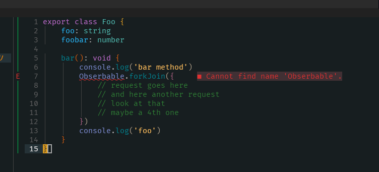

# Disclaimer
This is a highly experimental plugin. Breaking changes could be implemented.

# Bracket-Guides
Colorized the bracket scope in your code! *Loosely adaptation of [bracketpair](https://github.com/CoenraadS/BracketPair)*

## Requirements
Terminal emulator that fully supports **guisp**. Or used a Front-End, like [Neovide](https://github.com/neovide/neovide)

## Mention
This plugin is based on [nvim-hlchunk](https://github.com/yaocccc/nvim-hlchunk).
